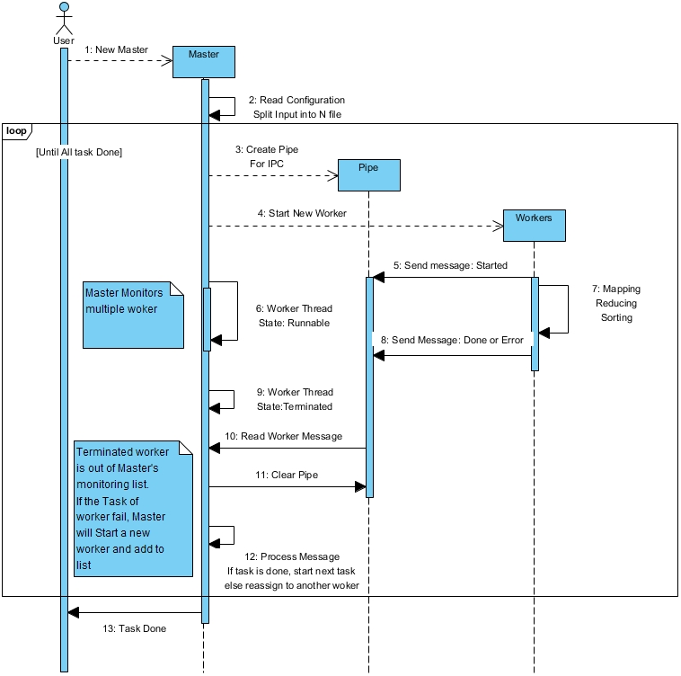

# Team member： Weigeng Li, Sijing Yu, Haoyang Ma

# Design Document
## 1. Overall MapReduce design
The overall of the MapReduce operation in our implementation is similar with original MapReduce System. The core UDF function are Map and Reduce. However, depending on different applications, we specify different UDF mapper functions.  We use multi-thread programming to mimic the distribute computing. Firstly, the Master will import the settings from the configuration file, such as the number of Mappers and Reducers, the UDF function, the location of the input file. Secondly, the Master thread will automatically partition the input file into M splits. M is a value defined by users. Then Master will allocate these splits to different Mappers. Mapper will read the split and transfer it into key value pairs under user's instructions. The number of reducer N is also defined by users, which means we have N intermediate files after mapping. After a mapper get a key value pairs, it will use a hash function to hash the key to N intermediate files. We transform the key or part of the key (e.g., in wordcount, we transform the first several letter of the key) as an int number(e.g., using ASCII) and then do mod(N) of this int number to indicate which intermediate file the key value pairs should be appended to. So, after all mapper finish their jobs, the same key will be located in the same intermediate file. After this operation, the Master will allocate one intermediate file to one reducer. The reducer will read the intermediate file iteratively and summarize the values of same keys. At the end, all the result for reducers will be combined together and we can get an output file.

Here is the flow chart of out MapReduce function.

## 2. UDF
User will use a configuration.java to define their own Map and Reduce function. Also, the number of Mapper and Reducer is defined here. Then, our Mapper and Reducer class will automatically implement the user defined map and reduce function. For this project, we specify 3 different UDF Map and Reduce functions, for wordcount, word length and movie files applications. For wordcount and word length, we split the text into word and set the word as key. For movie files, the key is genres of movies. All of the value of keys in intermediate files equal 1.

## 3. Multi-thread
During this whole process, there exist a Master and user defined numbers of Mappers and Reducers. There are no contact between any Mapper or Reducers. They only get the file location from the Master and then do their own jobs. All Mappers and Reducers use pipeline to contact with Master. When the Mapper or Reducer start the job, it will sent a 'Start' through pipeline to Master. When the job are finished or an error occurred, 'Done' and 'Error Information' will be sent to Master.

## 4. Fault tolerance
After the mapper allocate all jobs to Mappers or Reducers, it will automatically check the status of each thread. Here we use a loop, where the condition to jump out of the loop is all the threads successfully finish their jobs. We use the following method to implement this function: When the Master found a thread's status is 'terminated', then it will check the pipeline. If the thread's last output is 'Done', this means the thread finish it jobs. If the thread's last output is still 'Started', this means the thread did't finish it jobs and terminate accidentally. If the thread's last output is 'Error Information', the Master will terminate all the job and output the error information and ask the user to debug their UDF or modify there input data. When one task runs more than five times and still fail for no reason, master will also stop the reassign task.

## 5. Tradeoffs
**Pipe or Socket**  
For communication between threads, we can use JAVA Pipe or Socket. In this system we use Pipe. 
The advantage of Socket is that it can communicate one-to-many.It is more suitable for information exchange between servers and clients where severs have multiple threads to deal with each connection. However, this system are using only one thread in master. It can not receives message from multiple threads if they send at the same time.More, Socket has thread blocking problem. When worker(client) wants to send message to master(server) it must wait master's acceptation. When Master invoke accept() function, the thread will block until one connection is made. Base on these reason, Socket might not be good choose here.  
The advantage of Pipe is that it is cache oriented. The disadvantage of Pipe is buffer has Producer-consumer problem or Bounded-buffer problem. Thread can not write messages to pipe there is no space in the buffer. Thread can't read messages from pipe when there is nothing in the buff. when that happen thread will block. To fix that problem, we use larger buffer and brief the sending message. Also when each worker start, write "Started" into buffer to make sure even when the worker terminate accidentally, master still have something to read and not reach a block situation.  

**Lock for writing**  
While designing this system we make our best to avoid any competition for resources or lock between threads. Each worker has it's own pipe line to communicate with master.Out put of each thread are separate. We want to achieve higher speed even that will cost more memory or disk.

    

# Environment

## Software versions

​        Java 11

​        Python 3.8

​        Spark 3.2.1

​        Hadoop 3.2

## Packages used

​        Pyspark

# Instructions for testing

Just run the test.bat in the project directory.

The script will automatic start the MapReduce job and then run the python script 'compare'. The result of the comparison will be output to the console.

**Fault tolerance in testing**  
We use random numbers to simulate the possible error and unexpected failure in Worker.  
In Worker.java line 33, you can modify fault tolerance variable to raise error or a random worker stop.  
Run or debug test.java to see the reaction of system.  
See the Notes there for more Information.  